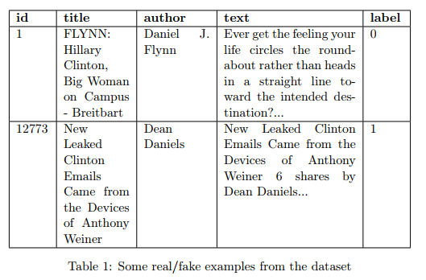

  

<h3 align="center">Detection of Fake News</h3>

  

---

 Simple NLP and ML project to improve applied ML skills with a real-world problem
      

## 🧐 About 
Will be predicting whether a headline and article text represents real or fake news from words that appear. For this purpose, **implemented Naive Bayes algorithm from scratch without using any external Machine Learning library** and used Bag-of-words model with different parameters. Also used Tf-idf to extract features for comparison.

## 📃 Dataset 

Fake News is a dataset provided to determine when an article is fake or real. It includes the following features:

- **id:** unique id for a news article
- **title:** the title of a news article
- **author:** author of the news article
- **text:** the text of the article, could be incomplete
- **label:** a label that marks the article as potentially unreliable
        
        1: unreliable
        0: reliable
        

## ✍️ Author 
+ [Öner İnce](https://github.com/OnerInce)  
